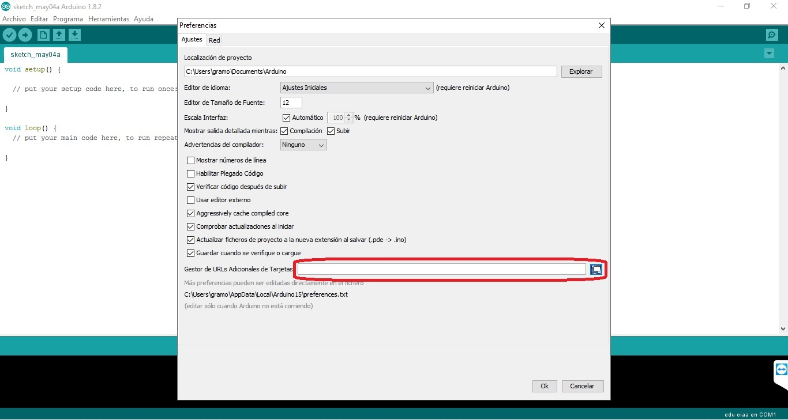
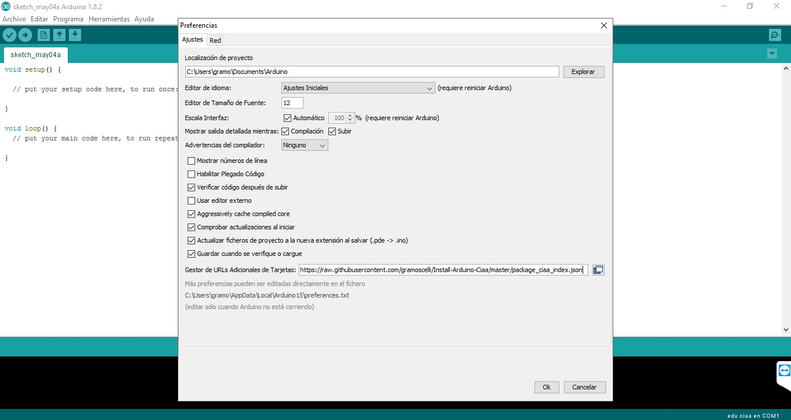
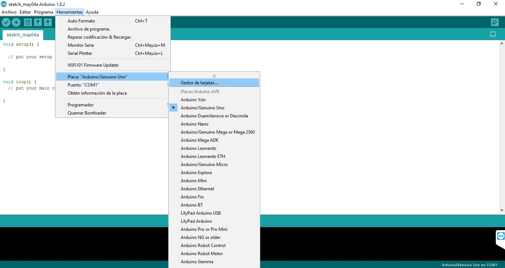
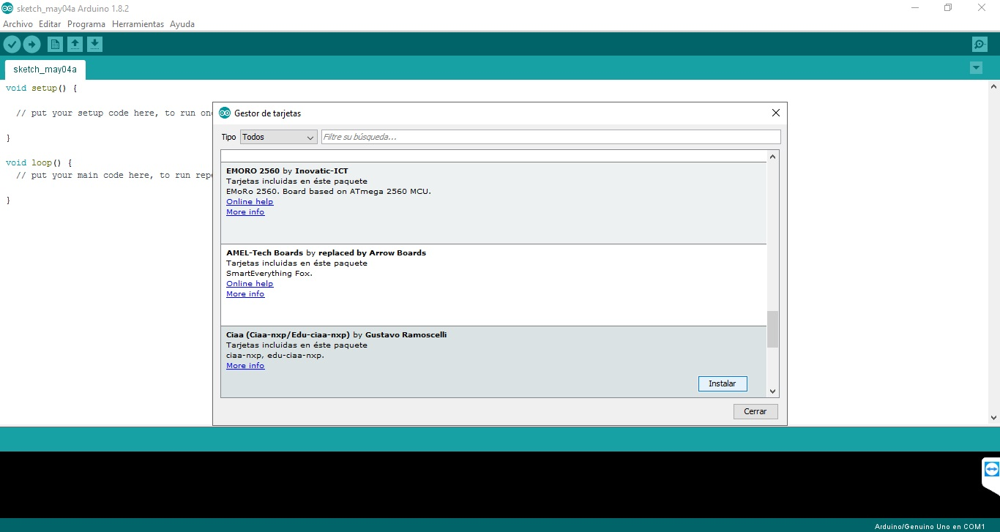
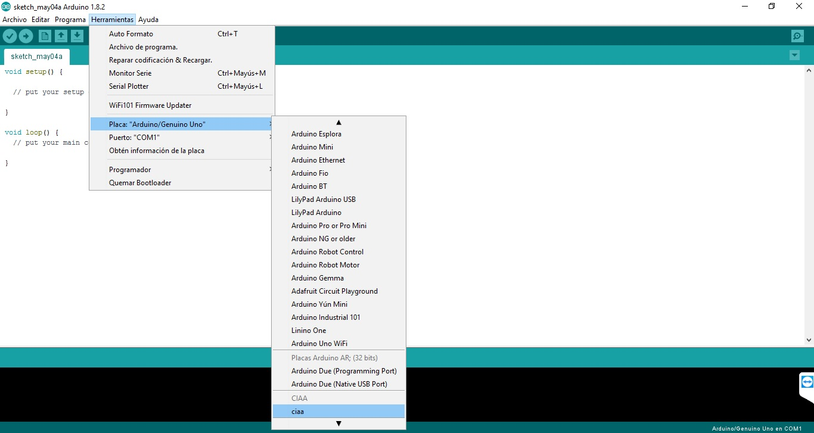

# Rama develop:
Se usa para testing de funciones Arduino vía sAPI. 

Funciones a implementar:

## Analog I/O
*   analogRead\(\) 
*   analogReference\(\) 
*   analogWrite\(\) 

Requisitos:

1\) **analogWrite\(\)** Writes an analog value (PWM wave) to a pin. Can be used to light a LED at varying brightnesses or drive a motor at various speeds. After a call to analogWrite(), the pin will generate a steady rectangular wave of the specified duty cycle until the next call to analogWrite() (or a call to digitalRead() or digitalWrite()) on the same pin.

2\)

3\)

4\)

5\)

# Usando el IDE de Arduino para programar las tarjetas CIAA-NXP/EDU-CIAA-NXP

Implementación no oficial de las especificaciones de Arduino (https://github.com/arduino/Arduino/wiki/Arduino-IDE-1.5-3rd-party-Hardware-specification) para compilar programas de la CIAA/Edu-CIAA usando el IDE de Arduino. Más información del proyecto CIAA en http://www.proyecto-ciaa.com.ar.

  Pasos para instalar la placa en el IDE Arduino:
  
  1\) Acceder a Archivo -> Preferencias. 
  
  
  
  2\) Agregar el URL del archivo JSON de instalación: https://raw.githubusercontent.com/gramoscelli/Install-Arduino-Ciaa/master/package_ciaa_index.json.
  
  
  
  3\) Iniciar el Gestor de Tarjetas desde Herramientas -> Placa...
  
  
  
  4\) Instalar la tarjeta Ciaa
  
  
  
  5\) Elegir la tarjeta Ciaa recién instalada, desde Herramientas -> Placa...
  
  
  
